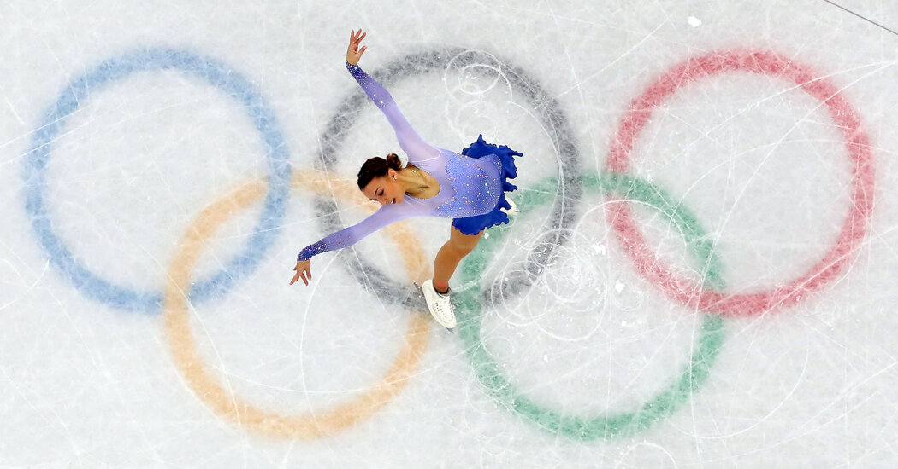

# Skating Score Project

### Introduction: 

   Historically, figure skating has been a sport in which the United States has greatly excelled in the Olympic Winter Games. Sports that are judged on both technical merit and artistic expression are challenging to judge objectively and figure skating is no exception. In 2004, the previous highly subjective figure skating scoring system was replaced with the International Judging System(IJS) which takes into account the minutiae of every skating program awarding a specific point value based on multiple calculations. Following this change, the United States has seen a drastic decrease in international accomplishment for women skaters representing the USA. 
 
   The recent 2022 Olympic winter games in Beijing marks 4 consecutive Olympics in which the US women have not been awarded a medal. Many critics of the current state of international figure skating suggest that the medal drought is directly related to Russian dominance in women's figure skating. Russian figure skating has been under scrutiny for their questionable training tactics and with a recently doping scandal at the 2022 Beijing Olympics, it's more than reasonable for all other skating federations to reject Russian figure skating training tactics and put the wellbeing of athletes ahead of competitive victories However, can the 15 year medal drought be completed contributed to this? 

   In the four most recent Winter Olympic Games, at least one of the women figure skating medals has gone to an athlete from Japan, South Korea, Italy, or Canada. It's also worth noting that the United States is continuing to excel greatly in most figure skating disciplines (especially mens and ice dancing). This project is a data-driven analysis of this project in which I explore trends that may offer insights to improve US women's figure skating scores at the Olympic Games. 

### Project Goals:

- Construct a machine learning regression model that improves predicted Olympic scores of women figure skaters under the International Judging System (implemented in 2004).
- Find the key drivers of Olympic event scores by analyzing competition data of athletes prior to their Olympic performances.
- Empower US figure skating athletes and coaches with information that may lead to positive training modifications.
- Thoroughly document the process and key findings.
- Prove the potentiality of utilizing the data science pipeline to better the sport of figure skating.

### Hypotheses :

> Jumping Difficulty- Based on basic domain knowledge, I believe skaters that demonstrate difficult jumping ability in international events will have higher Olympic scores. While triple axels and quadruple jumps are not very common in women's figure skating, the point value for these elements is very high so executing one or more of these jumps in a program can really set the athlete apart. Triple-triple combinations, although much more common, are still not something all women Olympians can do with ease so I am considering it a "difficult jump" at this time. I create separate columns for these 3 difficult jumping elements to explore this hypothesis.
 
> USA athletes and technical scores- I hypothesize that USA skaters have lower technical/elements scores, especially compared to Olympic medals. I am curious to see how far behind USA skaters are to the top performers in this category and whether or not there appears to be a trend throughout the seasons.
 
> USA athletes and components scores - Historically, USA skaters have been known to have strong "presentation." Under the former scoring system, the "presentation score" was closest to what the components score is currently, yet the components score is calculated with more objective criteria. Do USA athletes have an edge in the components score as they did in the presentation score? While I did not acquire old scores prior to 2004 for this project, I will compare components scores by country groupings to see where USA athletes stand. 
 

### Summary of Findings & Recommendations:

- My analysis indicates that the top drivers of Olympic Scores are:
     > - Athlete's 4 year international competitive history preceding the Olympics
     > - Short Program Event Scores (components and elements)
     > - Free Program Event Scores (components and elements)
     > - Event placements
     > - competitive season

- My data exploration revealed that USA athletes' scores are lower than desired due to :
     > - USA athletes have a lower margin of score improvement over the last 15 years compared to non-USA athletes
     > - The elements portion of free program shows the worst margin of improvement for USA athletes 
     > - USA athletes still slightly outscore non-USA athletes in the components score, but if the trend over the last 15 years continues, USA athletes may fall behind in this category as well
     > - USA athletes' element scores seem to be more problematic in the free program. Because the free program is longer than the short program, lack of athletic endurance is one possible explanation to explain this discrepancy.

- Interestingly, the skater's 4 year average amount of technical jumping errors did not seem to be a factor contributing to Olympic scores. 

- I built and trained a Generalized Linear Model(Tweedie Regressor) which is able to improve baseline predicted Olympic scores by approximately 50%.
 
- I can recommend employing this new model with reasonable confidence.

- I believe this project demonstrates great promise for the use of data science in improving training strategies and competition outcomes in US Figure Skating.

### Reproducing this project
Clone this repository via github through your terminal and run the report in jupyter notebooks. Be sure to clone the entire repository as .py files are necessary for data acquisition, data wrangling, preparation, and exploration.